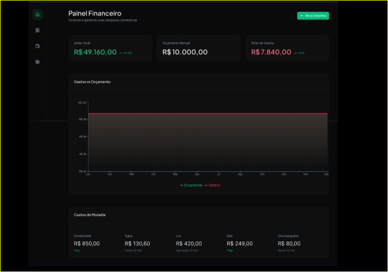
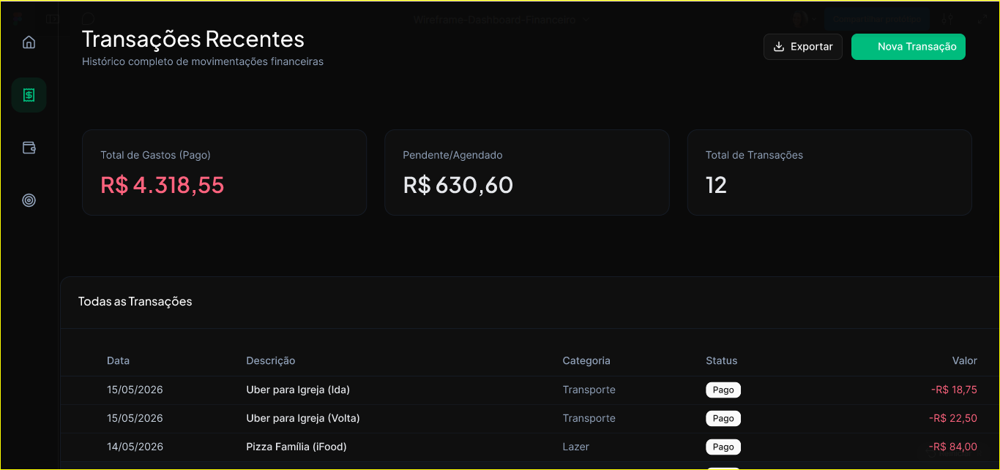
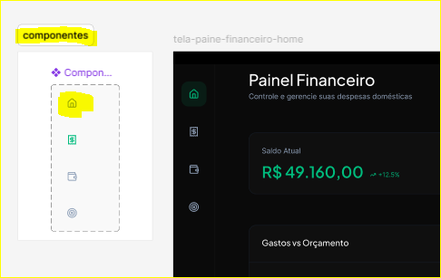

# 📐 Wireframe de Alta Fidelidade: Dashboard Financeiro

> Projeto prático integrando conceitos de UX Design, Arquitetura de Informação e automação de workflow entre Figma e GitHub.

Este repositório contém a documentação visual e estrutural de um **Dashboard de Gestão Financeira Doméstica**, desenvolvido como desafio de projeto para a formação **UI/UX Design da DIO** e fundamentado pelos princípios do **Google UX Design Certificate** que estou estudando em simultâneo.

---

## 🚀 Diferencial Técnico: Engenharia de UX & IA-Assisted Design

Como entusiasta de **Front-End e UX Design**, este projeto explora a intersecção entre a velocidade da IA e o rigor da estruturação de interfaces.

* **IA-Assisted Design**: Utilizei ferramentas de IA para conceber a arquitetura de informação inicial, otimizando o processo de ideação de wireframes de alta fidelidade.
* **Automação de Workflow**: Utilizei o plugin *html-to-design* para importar estruturas conceituais para o Figma, garantindo que o protótipo mantivesse consistência estrutural.
* **Objetivo**: Validar a viabilidade de uma interface de controle financeiro voltada para o contexto familiar, focando na organização de gastos complexos (fixos e semivariáveis).

---

## 🎨 Análise do Wireframe

O foco deste projeto foi validar a **Arquitetura de Informação** e a **hierarquia visual** de um sistema de finanças voltado para a rotina urbana de São Paulo.

### 1. Dashboard Home (Visão Macro)

* **Resumo Financeiro**: Cards de saldo e orçamento desenhados para impacto imediato ("above the fold").
* **Custos de Moradia**: Widget segmentado para despesas de condomínio, essencial para o controle de gastos que variam mensalmente (Água, Luz, Gás).
* **Análise Visual**: Gráfico de área para comparação de gastos vs. orçamento, permitindo uma leitura rápida do comportamento financeiro familiar.

### 2. Transações Recentes (Gestão Detalhada)

* **Tabela de Dados**: Organizada para *scannability*, com colunas claras para data, descrição, categoria e status do pagamento.
* **Contexto Real**: Registro de transações que refletem a realidade de uma gestora familiar em SP (Uber para igreja, mensalidade da faculdade, compras no Pão de Açúcar).
* **Hierarquia**: Uso de cores semânticas (vermelho para despesas/saídas) para guiar o olhar.

### 3. Componentização & Estrutura

* **Organização**: Estrutura modular baseada em blocos reutilizáveis (cards e linhas de transação), facilitando a futura implementação em bibliotecas de componentes como *shadcn/ui* ou *PrimeNG*.

---

## 🎮 Interação e Acesso

Você pode visualizar a estrutura e o fluxo do protótipo no Figma:

🔗 **[Acessar Protótipo Financeiro](https://www.figma.com/proto/VFWJFuFE2iXFDX6PNhQvwD/Wireframe-Dashboard-Financeiro?node-id=0-1&t=WZfV14TpBIgxYwK2-1)**

---

## 🛠️ Ferramentas Utilizadas

* **Figma**: Design de interface e prototipagem.
* **IA Generativa**: Ideação e arquitetura de informação.
* **html-to-design**: Automação de estruturação de camadas.
* **GitHub**: Versionamento e documentação técnica.

---

## 👩🏻‍💻 Conceitos de UX Aplicados

* **Arquitetura de Informação**: Segmentação lógica entre "Visão Geral" (Home) e "Detalhamento" (Transações).
* **Gestão de Carga Cognitiva**: Agrupamento de despesas semivariáveis (moradia) para facilitar a leitura.
* **Hierarquia Visual**: Uso de contraste de cores para destacar saldo positivo e despesas recorrentes.

---

## ✍️ Autora

**Miriã Amaral**
* Front-End Developer (Angular/TypeScript).
* Estudante de ADS & Design de UX.
* 🔗 **[LinkedIn Miriã Amaral Custódio Santos](https://www.linkedin.com/in/miriaamaralcs)**
